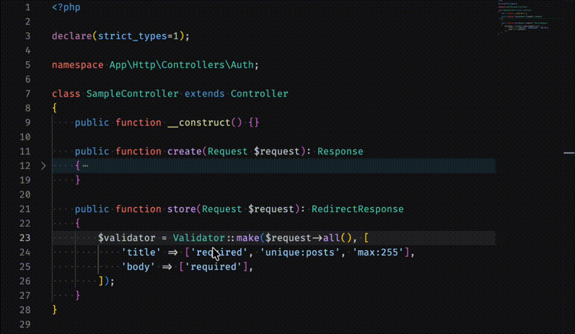

# Laravel Facade Resolver

Speed up your Laravel & Larastan (PHPStan Level 10) development workflow!

This VS Code extension instantly resolves Laravel Facades to their underlying bound classes when you hover over them. Instead of clicking through `Facade -> getFacadeAccessor() -> Global Search for bindings`, this extension does it all automatically for you.

## Features

- **Instant Facade Resolution**: Hover over any facade (e.g. `Hash::`) to see the actual class it resolves to.
- **PHPStan Level 10 Ready**: Knowing the exact bound class is essential for writing accurate `@var` annotations and satisfying strict static analysis.
- **Core Laravel Support**: Comes pre-mapped with all core Laravel facades for zero-latency resolution.
- **Dynamic Custom Facades**: Automatically searches your `app/Providers/` directory to resolve your own custom Facades dynamically!

## Preview

## Usage

1. Open any PHP file.
2. Hover your mouse cursor over a Laravel Facade or Global Helper (e.g. `Cache::`, `Auth::`, `event()`, `__()`, or `YourCustomFacade::`).
3. A tooltip will appear showing the fully qualified class name bound to that facade.

## Requirements

- VS Code 1.85.0 or higher.
- A Laravel workspace with Facades or `app/Providers` available for custom bindings.
- PHP extension (like Intelephense) should be active to provide Go-to-Definition data.

## Extension Settings

This extension contributes the following settings:

* `laravelFacadeResolver.enable`: Enable/disable this extension.

## Known Issues

- Custom facade resolution performs a basic regex search on `app/Providers`. It might not perfectly resolve highly dynamic bindings or bindings located in vendor packages.

## [Release Notes](./CHANGELOG.md)

### 1.2.0
- **Architectural Code Actions**: Introduced "Convert to Constructor Injection" quick action (Ctrl+.) to automate refactoring Facades to DI.
- **SOLID Education Engine**: Integrated contextual SOLID tips in hovers, including SRP warnings for classes with too many dependencies.
- **Architecture Health Report**: Added `Analyze Architecture Health` command to score your file's SOLID compliance.
- **Deep Key Validation**: Implemented nested validation for `config()` keys and file-existence checks for `view()` helpers.
- **Service Lifecycle Education**: Added visual indicators (🔒 Singleton / 🔄 Transient) to hovers based on service provider bindings.
- **Docstring Proxying**: Tooltips now extract and display the original class-level documentation from the underlying Contract/Interface.
- **Testing & Mocking Integration**: Added dedicated snippets in hovers for quick Mockery/Laravel test setup.
- **Blade File Support**: Extended all resolution and validation features to `.blade.php` files.
- **Custom Domain Support**: Added support for `.facade-resolver.json` to map custom or third-party services.
- **Enhanced Code Lenses**: Added unobtrusive DI reminders above methods using Facades.

### 1.1.0
- Added ability to import facade classes by clicking on import in the tooltip
- Added **Global Helper Resolution**: Resolves Laravel's global helper functions (e.g., `event()`, `__()`, `redirect()`) to their underlying Dependency Injection Contracts, resolving Larastan's `noGlobalLaravelFunction` strict rules.
- **Import Feedback**: The `[Import]` button will now display a notification if the class is already imported, instead of failing silently.
- **New Helpers**: Added support for `abort()`, `abort_if()`, and `abort_unless()`.
- **Bug Fixes**: Fixed missing `.js` extension on internal resolver imports which could cause activation issues in some environments.
- **New Helpers**: Added support for `route()` resolving to `Illuminate\Contracts\Routing\UrlGenerator`.

### 1.0.1
- Added missing Laravel Facades (`Broadcast`, `Bus`, `Context`, `Date`)

### 1.0.0
- Initial release
- Core Laravel facade mapping
- Dynamic search in `app/Providers`
